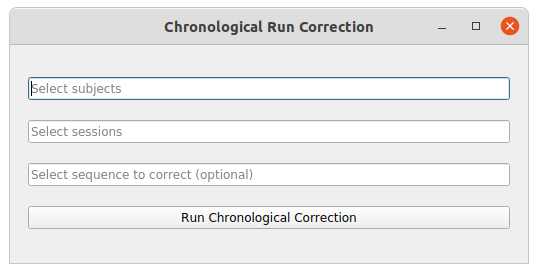

# Chronological Run Correction

When converting DICOM to nifti format, if several sequences are identified as the same sequence by BMAT, the software will auomatically add the key 'run' into the name with a number to not overwrite an already converted sequence. Unforunately, it gives this number randomly and does not consider any other information (the acquisition time for example). In some cases, it does not cause any issue, but most of the time, it is interesting to have all identical sequences ordered in the chronological order. This pipeline allows to correct the name of converted sequences in BMAT based on their chronological order. 

## Utilization 

You will find above an image of the window of this pipeline. This window allows the user to enter for which subjects, sessions and sequences he wants to correct the filename based on their chronological order of acquisition, and then to launch the pipeline. Here is a list of the features contained in this window:

* "Select subjects" input: allows the user to script the filename correction for several subjects of the dataset by adding a list BIDS ID (without "sub-") separated by a comma. Possible values are: single BIDS ID (e.g. "001,002,006,013"), multiple folowing BIDS ID (e.g. "001-005" is the same as '001,002,003,004,005"), or all subjects ("all").

* "Select sessions" input: allows the user to script the filename correction for several sessions of subjects of the dataset by adding a list session ID (without "ses-") separated by a comma. Possible values are: single session ID (e.g. "01,02,06,13"), multiple folowing session ID (e.g. "01-05" is the same as '01,02,03,04,05"), or all sessions ("all").

* "Select sequences (optional)" input: allows the user to run the chronological correction on only a specific subset of sequences. For that indicate the space of the sequences to run the correction separated by a comma. By default or if left empty, the chronological correction will be perform on all the sequences of the subject.

* "Run Chronological Correction" button: launch the chronological correction script based on all information given by the user.

By default, this pipeline will apply the image processing on the image with the following sequence name: *acq-WRAPPED_part-pahse_T2starw*. If you want to change the name of the sequence on which to run this pipeline, you can change that in the *phase_unwrapping.json* file in the *src* folder (This file is shown below) by changing the value of the *phase* field in the *add_info* dictionary to match the name of your sequence. 

